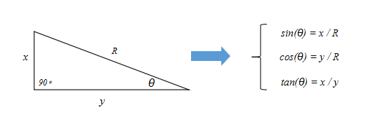
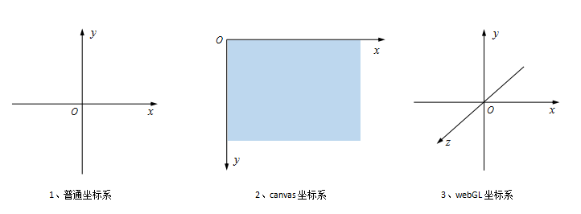
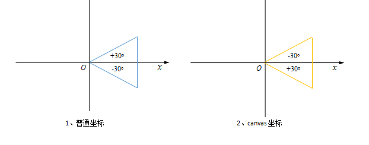
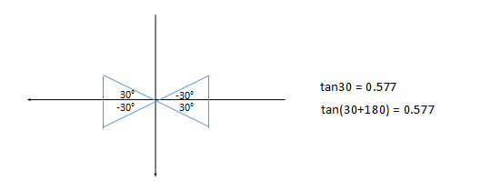
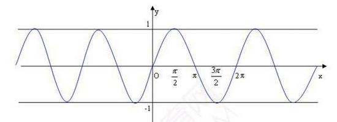

# 三角函数
> 所谓三角函数，在几何上来说就是夹角与边的关系！

## 公式



## 坐标



与普通坐标不同，canvas坐标以整个画布的左上角作为坐标原点，y轴朝下为正，x轴水平向右。



坐标不同，对应的角度表示就有所差异，这个差异主要体现在角度的正负上。

## 常用的三角函数
前面简单的介绍了三角函数的表示方法以及canvas的坐标系统。

在实际开发中，不仅想要通过角度来推出两边的距离长度比值。还要知道怎么**通过已知的距离(因为坐标的位置很好确定)来推出角度**。这里我们要用到**反三角函数**


```
sin(θ)=x/R   --->  θ = arcsin(x/R)
cos(θ)=y/R   --->  θ = arccos(y/R)
tan(θ)=x/y   --->  θ = arctan(x/y)
```

对应到javascript中,相应表示方法如下：

```
sin(θ)  --->  Math.sin( θ * Math.PI/180 )
cos(θ)  --->  Math.cos( θ * Math.PI/180 )
tan(θ)  --->  Math.tan( θ * Math.PI/180 )

θ = arcsin(x/R) ---> Math.asin(x/R)*(180/Math.PI)
θ = arccos(y/R) ---> Math.acos(y/R)*(180/Math.PI)
θ = arctan(x/y) ---> Math.atan(x/y)*(180/Math.PI)
```
角度转弧度：` θ * Math.PI/180`

弧度转角度：`弧度 * 180/Math.PI`

## `Math.atan2(dy, dx)`
在计算角度的时候，更多的是用到Math.atan()，它可以直接通过两个直角边得到对应的角度值。计算过程更加简单！但是，它有一个问题——**存在两个相同的角度值而无法判定物体具体的旋转角度**。详细说明如下图所示：


由图可以看出tan函数的周期是（-π/2, π/2），这一特性导致电脑是无法判断旋转的到底是哪个角度。
于是Math对象提供了atan2方法解决上面所说的问题，可以计算出对应的角度值。


## 实例：跟随鼠标旋转的箭头

[跟随鼠标旋转的箭头](https://ihhu.github.io/demo/canvas/%E4%B8%89%E8%A7%92%E5%87%BD%E6%95%B0/rotate-to-mouse.html)

# 运用
## 波形运动

```
//sin函数在[0, 2π]之间的值
for(var angle=0; angle<Math.PI*2; angle+=0.1){
    console.log(Math.sin(angle)); //打印出角度对应的sin值
}
```


